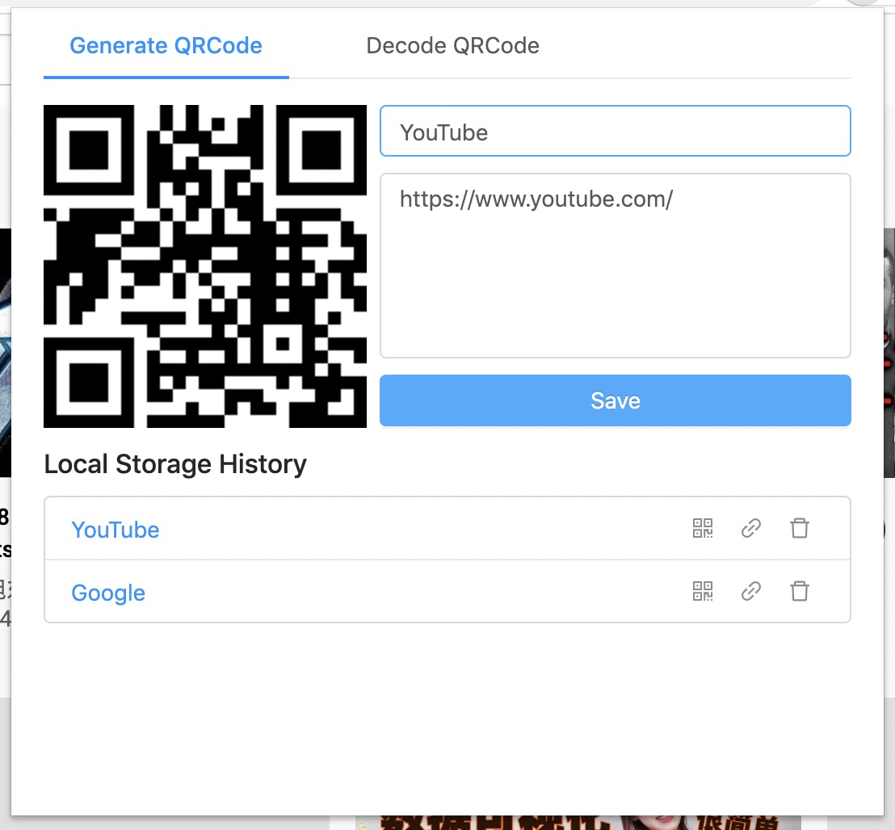
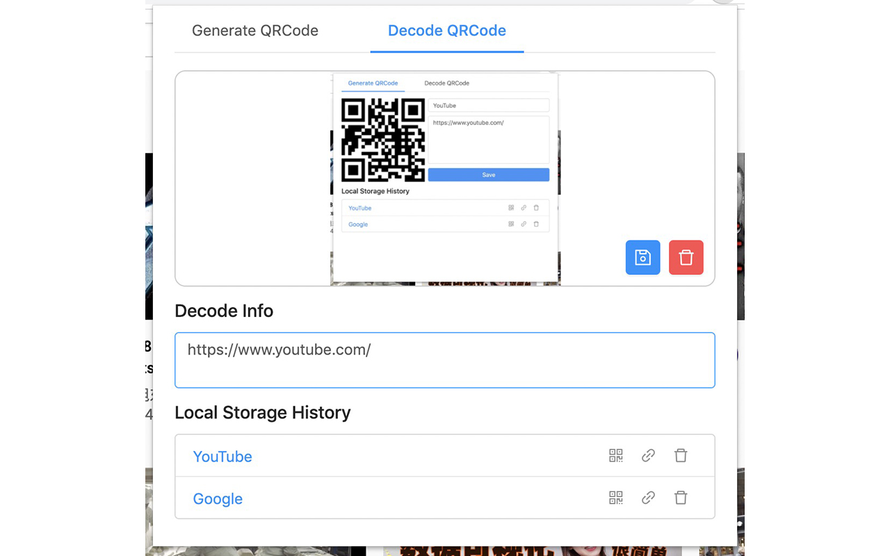

# Chrome Extension QRCodePro

Chrome Extension Webstore: https://chrome.google.com/webstore/detail/qrcodepro/ipblkdfaeagmojkgohnhiknbmepfokdd

QRCodePro help you create QRCode easily and decode you QRCode Image to URL easily.

## Generate QRCode

## Decode QRCode

From you clipboard image file

